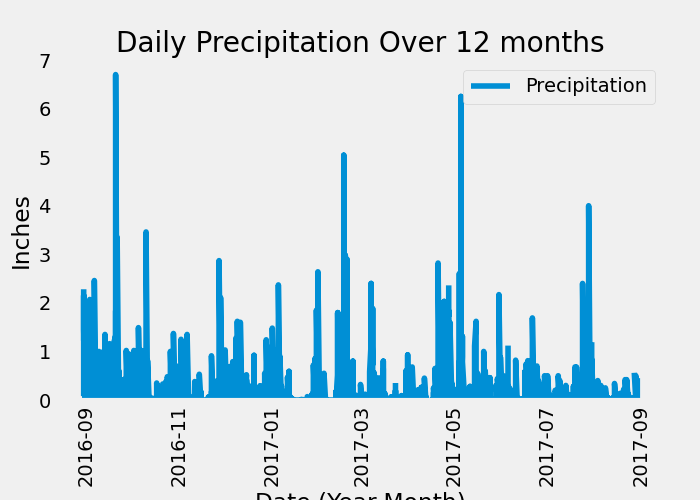
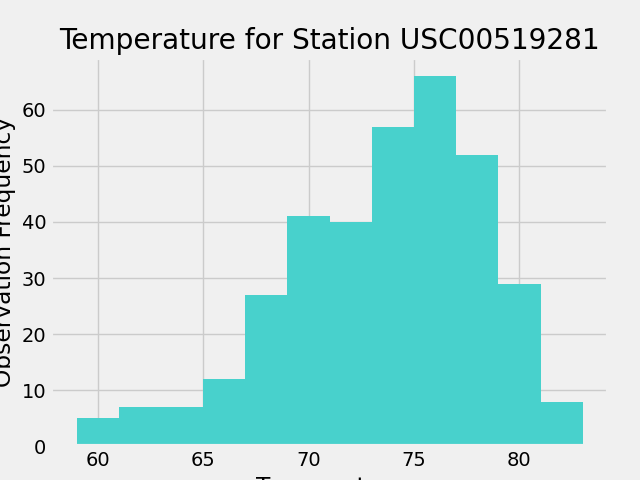

# sqlalchemy-challenge

## Background

 Congratulations! You've decided to treat yourself to a long holiday vacation in Honolulu, Hawaii. To help with your trip planning, you decide to do a climate analysis about the area. The following sections outline the steps that you need to take to accomplish this task.

## Technologies Used
- Python
- SQLAlchemy
- Pandas
- Matplotlib

## Objectives

    Part 1: Analyze and Explore the Climate Data
    Part 2: Design Your Climate App

## Set up and dependencies

    %matplotlib inline
    from matplotlib import style
    style.use('fivethirtyeight')
    import matplotlib.pyplot as plt

    import numpy as np
    import pandas as pd
    import datetime as dt
    from pprint import pprint

## Reflect Tables into SQLAlchemy ORM
## Python SQL toolkit and Object Relational Mapper

    import sqlalchemy
    from sqlalchemy.ext.automap import automap_base
    from sqlalchemy.orm import Session
    from sqlalchemy import create_engine, func
    from sqlalchemy.ext.declarative import declarative_base
    from sqlalchemy import Column, Integer, String, Float
    from sqlalchemy.types import Date

## Data Analysis and Exploration

    First, set up base, create classes for each table, and connect to the sqlite database.

```python
# Set up Base
    Base = declarative_base()
    

# Create classes for tables within database
    class Measurement(Base):
      __tablename__ = "measurement"
    
      id = Column(Integer, primary_key=True)
      station = Column(String)
      date = Column(Date)
      prcp = Column(Float)
      tobs = Column(Float)

    class Station(Base):
        __tablename__ = "station"
    
        id = Column(Integer, primary_key=True)
        station = Column(String)
        name = Column(String)
        latitude = Column(Float)
        longitude = Column(Float)
        elevation =  Column(Float)


# Connect to database
    engine = create_engine("sqlite:///Resources/hawaii.sqlite")
    conn = engine.connect()
    session = Session(bind=engine)


# Reflect the database schema
    Base = automap_base()
    Base.prepare(engine, reflect=True)


# Print all of the classes that automap found
    print(Base.classes.keys())

```

# Exploratory Precipitation Analysis


```python
# Get the last 12 months of precipitation data

    recent_prcp = session.query(Measurement.date, Measurement.prcp)\
     .filter(Measurement.date > '2016-08-23')\
     .filter(Measurement.date <= '2017-08-24')\
     .order_by(Measurement.date).all()
        
    pprint(recent_prcp)


# Load query results into a Pandas dataframe

    prcp_df = pd.DataFrame(recent_prcp, columns = ["Date", "Precipitation"])


# Set index to the date column

    prcp_df.set_index("Date", inplace=True)

    prcp_df


# Convert date column to datetime for formatting in plot

    prcp_df.index = pd.to_datetime(prcp_df.index, format="%Y/%m/%d")


# Plot precipitation results using Dataframe plot method

    prcp_plot = prcp_df.plot(figsize=(7,5), ylim=(0,7), title = "Daily Precipitation Over 12 months", rot=90)
    prcp_plot.set_ylabel("Inches")
    prcp_plot.set_xlabel("Date (Year-Month)")
    prcp_plot.grid()
    plt.savefig("Images/precipitation.png")
    plt.show()
```


```python
# Print a summary statistics table for the precipitation data
    precipitation = prcp_df["Precipitation"].to_frame()
    precipitation.describe()
```

## Exploratory Station Analysis

```python
# Calculate the total number of stations

    total_stations = session.query(func.count(func.distinct(Measurement.station))).first()[0]
    total_stations


# Find the most active stations

    active_stations = session.query(Measurement.station, func.count(Measurement.id))\
       .group_by(Measurement.station)\
       .order_by(func.count(Measurement.id).desc()).all()

    active_stations


# Get the last 12 months of temperature observation data for station USC00519281

    tobs_station = session.query(Measurement.station, Measurement.tobs)\
       .filter(Measurement.date > '2016-08-23')\
      .filter(Measurement.date <= '2017-08-23')\
     .filter(Measurement.station == "USC00519281").all()

    tobs_station


# Convert results to a dataframe for plotting
    station_temp_df = pd.DataFrame(tobs_station, columns=["Station", "Temp. Observations"])
    station_temp_df.head()


# Get the most active station ID from the previous query
    most_active_station = active_stations[0][0]


# Query the minimum, maximum, and average temperature for the most active station
    temp_stats = session.query(func.min(Measurement.tobs), func.max(Measurement.tobs), func.avg(Measurement.tobs))\
       .filter(Measurement.station == most_active_station).all()


# Extract the results
    tmin, tmax, tavg = temp_stats[0]


# Print the results
    print(f"Lowest temperature at station {most_active_station}: {tmin} degrees F")
    print(f"Highest temperature at station {most_active_station}: {tmax} degrees F")
    print(f"Average temperature at station {most_active_station}: {tavg} degrees F")

# plot a histogram of the results

    station_temp_df["Temp. Observations"].hist(bins=12, color="mediumturquoise")
    plt.title("Temperature for Station USC00519281")
    plt.xlabel("Temperature")
    plt.ylabel("Observation Frequency")
    plt.savefig("Images/histogram.png")
    plt.show()
```


